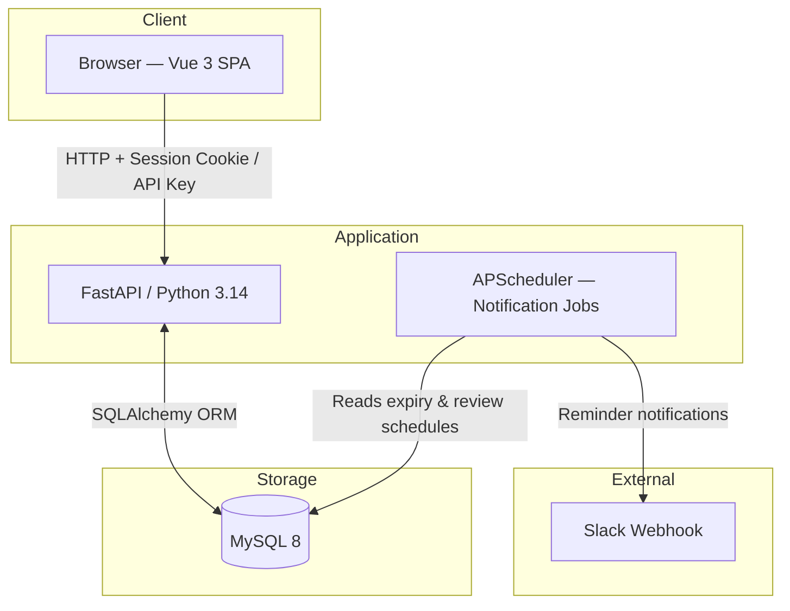
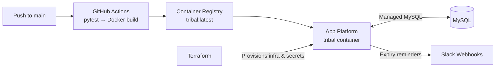

# Tribal

Credential lifecycle management for teams. Track TLS certificates, API keys, SSH keys, and other secrets — get Slack reminders before they expire, auto-detect expiry from live endpoints, and maintain a full audit trail.

## Tech Stack

| Layer | Technology |
|---|---|
| Backend | Python 3.14, FastAPI, SQLAlchemy, APScheduler |
| Database | MySQL 8 |
| Frontend | Vue 3, TypeScript, Vite, Tailwind CSS, Pinia |
| Auth | Session cookies + Bearer API keys |
| Infra | Docker, DigitalOcean App Platform, Terraform |

---

## Architecture

### Application



### Production Deployment



The frontend is compiled into the Python image at build time and served as static files by FastAPI. There is no separate frontend service in production — a single container handles everything. The APScheduler runs inside the same process as the API server; see the [Roadmap](#roadmap) for plans to decouple this.

---

## Running Locally

Requires Docker and Docker Compose.

```bash
# Build and start (first run downloads images and builds the frontend)
docker compose up --build

# Stop
docker compose down
```

The Docker build compiles the Vue frontend (Node 22) then packages it into the Python image. On first launch the database schema is created automatically via SQLAlchemy. Open `http://localhost:8000` and register — the first account becomes the admin and is prompted to name their team.

### Environment Variables

No environment variables are required by default. The JWT signing key is generated on first startup and stored in the `app_secrets` table, so sessions survive restarts and deploys without any configuration. To rotate it, see [Rotating the JWT signing key](#rotating-the-jwt-signing-key).

---

## Testing

Tests use an in-memory SQLite database and do not require the full stack to be running.

```bash
docker compose build
docker compose run --rm --no-deps tribal python -m pytest tests/ -v
```

---

## Frontend Development

For hot-reload during UI work, run the Vite dev server alongside the backend:

```bash
# Terminal 1 — backend
docker compose up

# Terminal 2 — frontend dev server (proxies /api, /auth, /admin to :8000)
cd frontend
npm install
npm run dev        # http://localhost:5173
```

Other frontend scripts:

```bash
npm run build      # production build → outputs to ../static/
npm run typecheck  # TypeScript type check (vue-tsc --noEmit)
npm run preview    # preview the production build locally
```

The production build outputs content-hashed assets to `static/assets/`. These are served by FastAPI at `/static/*` and do not need to be committed — they are regenerated during `docker compose up --build`.

---

## Deploying to Production

Tribal is designed to run as a single container on any container hosting platform. The reference deployment uses DigitalOcean App Platform with infrastructure managed via Terraform.

### CI/CD

Pushing to `main` triggers `.github/workflows/release.yml`, which:
1. Runs `pytest` — fails fast on any test failure
2. Builds and pushes the Docker image to a container registry as `tribal:latest`
3. App Platform detects the new image and redeploys automatically

Infrastructure changes (Terraform) are applied manually via `workflow_dispatch` on `.github/workflows/deploy-dev.yml`, or locally with `terraform apply`.

### Terraform

```bash
cd terraform
terraform init
terraform apply
```

`terraform apply` provisions the App Platform service and a VPC. The JWT signing key is *not* managed by Terraform — the application generates and stores it in the database on first startup (see [Rotating the JWT signing key](#rotating-the-jwt-signing-key)).

### Environment Variables (Production)

| Variable | Required | Notes |
|---|---|---|
| `DATABASE_URL` | Yes | MySQL connection string |

### Rotating the JWT signing key

The JWT signing key lives in the `app_secrets` table and is created automatically. To rotate it (e.g. after a suspected compromise), call the admin-only endpoint:

```bash
curl -X POST https://<host>/admin/rotate-jwt-secret \
  -H "Authorization: Bearer <admin-api-key>"
```

Or from a logged-in admin browser session:

```bash
curl -X POST https://<host>/admin/rotate-jwt-secret \
  -H "Cookie: session=<admin-session-cookie>"
```

Rotation invalidates **every active session immediately** — all users (including the caller) must log in again. The action is recorded in the audit log under `admin.rotate_jwt_secret`.

If you run more than one container replica, perform a rolling restart after rotation so each replica reloads the new key from the database.

---

## Roadmap

Items are loosely ordered by priority. Contributions welcome.

- **Admin-gated registration** — Invite-only or admin-approved account creation to prevent open sign-up.
- **Resource-level ownership** — Restrict edits and deletes to the resource owner or admins; currently any authenticated user can modify any resource.
- **Multi-tenancy** — Multiple isolated organizations, each with their own users, teams, resources, and settings.
- **Enterprise SSO** — Entra ID (Azure AD) authentication via OIDC, alongside existing email/password auth.
- **Async notification queue** — Decouple the APScheduler from notification delivery using a DB-backed or Celery/Redis queue for reliability and horizontal scale.
- **JIRA integration** — Create JIRA issues as an alternative (or complement) to Slack notifications when credentials are nearing expiry.

---

## License

MIT
